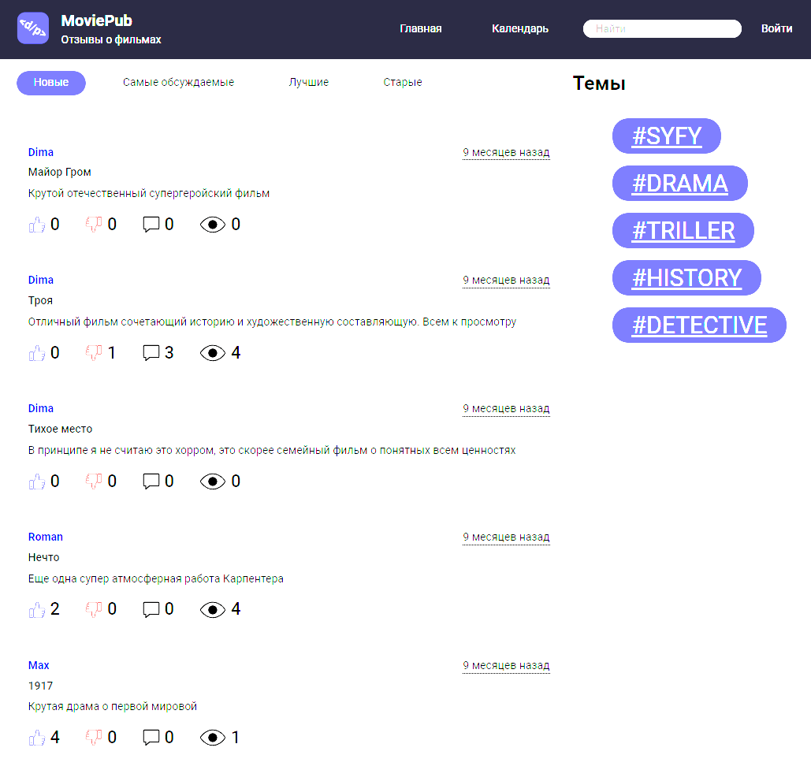

# __Блоговый дивжок__
***
***
## Описание проекта
_В данном проекте реализована бэкэнд состовляющая блога о фильмах ___MoviePub___, где вы можете оставить свой отзыв о
фильме или сериале. Вы можете пройти регистрацию, создавать отзывы, комментировать различные рецензии, оставлять лайки
или дизлайки. Движок также позволяет удобно сортировать рецензии, выводить их в зависимости от количества лайков, комментарий
или просто по дате публикации. Также имеются теги по которым можно быстро вывести только интересующие Вас жанры, что 
существенно облегчает поиск интересных Вам рецензий. В движке реализована модерация, в зависимости от глобальных настроек 
отзыв может сразу попадать в общую публикацию, либо пройти проверку админом и только после проверки одобрения попасть в 
общий доступ. Имеется личный кабинет, где вы можете настроить свой аватар, поменять почту или пароль при необходимости.
Там же вы можете редактировать свои посты, скрывать или удалять их._
***

***
## Используемы стэк технологий
- JDK 11
- SpringBoot
- SpringData
- SpringSecurity
- SpringMVC
- MySQL 8
- Hibernate
- Lombok
- Thymeleaf
- Maven
***
По данной ссылке "[MoviePub](https://movie-blog-java-skillbox.herokuapp.com/posts/recent)" вы можете самостоятельно "пощупать"
движок в работе.
***
Буду рад любому фидбэку: ___dimabeastpv@gmail.com___